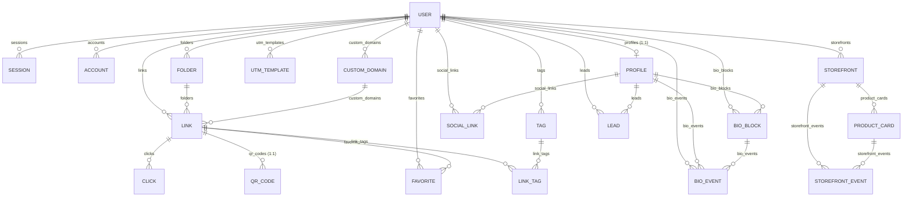

# LinkNest Database — Full Schema, ER Diagram & Feature Map

Complete reference for every table in the LinkNest database: the **schema** (columns), the **connections** (foreign keys), and **which feature** each table powers. GitHub renders the diagram below natively.

---

## Entity Relationship Diagram

## Legend

| Symbol | Meaning |
|--------|---------|
| `||--o{` | One to many (1 → ∞). Deleting the "one" side cascades to the children |
| `||--o\|` | One to one (1 → 1) |
| 🔑 | Primary key · **FK** | Foreign key · `?` | Nullable |

---

# 1. 🔐 Better Auth — Auth Feature

Tables powering login/signup, sessions, and OAuth (email + Google).

### `users` — the root table of the whole app

| Column | Type | Notes |
|--------|------|-------|
| `id` 🔑 | String | |
| `name` | String | |
| `email` | String | `@@unique` |
| `emailVerified` | Boolean | default `false` |
| `image` | String? | avatar URL |
| `createdAt` / `updatedAt` | DateTime | |

### `sessions` — keeps users logged in

| Column | Type | Notes |
|--------|------|-------|
| `id` 🔑 | String | |
| `token` | String | `@@unique` |
| `expiresAt` | DateTime | |
| `ipAddress` / `userAgent` | String? | |
| `userId` FK | String | → `users.id`, **Cascade** |

### `accounts` — email & Google OAuth links

| Column | Type | Notes |
|--------|------|-------|
| `id` 🔑 | String | |
| `accountId` | String | OAuth account id |
| `providerId` | String | e.g. `"google"` / `"credential"` |
| `userId` FK | String | → `users.id`, **Cascade** |
| `accessToken` / `refreshToken` / `idToken` | String? | OAuth tokens |
| `accessTokenExpiresAt` / `refreshTokenExpiresAt` | DateTime? | |
| `scope` | String? | |
| `password` | String? | hashed password for email login |

### `verifications` — email verification & password-reset tokens

| Column | Type | Notes |
|--------|------|-------|
| `id` 🔑 | String | |
| `identifier` / `value` | String | token pair |
| `expiresAt` | DateTime | |

---

# 2. 🔗 Phase 1 — Link Management (Smart Links)

The core link-shortener feature: short URLs, folders, tags, favorites, QR codes, custom domains, UTM templates, and click analytics.

### `links` — the short links

| Column | Type | Notes |
|--------|------|-------|
| `id` 🔑 | UUID | |
| `slug` | String | `@@unique` — the short path |
| `destination` | String | where it redirects |
| `title` / `description` / `notes` | String? | optional details |
| `userId` FK | String | → `users.id`, **Cascade** |
| `folderId` FK | String? | → `folders.id`, **SetNull** |
| `customDomainId` FK | String? | → `custom_domains.id`, **SetNull** |
| `isArchived` | Boolean | default `false` |
| `passwordHash` | String? | password-protected links |
| `expiresAt` / `activateAt` | DateTime? | scheduling |
| `active` | Boolean | default `true` |
| `utmSource` / `utmMedium` / `utmCampaign` / `utmTerm` / `utmContent` | String? | UTM params |
| `iosDeepLink` / `androidDeepLink` | String? | app deep links |
| `deletedAt` | DateTime? | soft delete |

### `folders` — organize links

| Column | Type | Notes |
|--------|------|-------|
| `id` 🔑 | UUID | |
| `name` | String | `@@unique([userId, name])` |
| `userId` FK | String | → `users.id`, **Cascade** |

### `clicks` — link click analytics

| Column | Type | Notes |
|--------|------|-------|
| `id` 🔑 | UUID | |
| `linkId` FK | String | → `links.id`, **Cascade** |
| `ipHash` | String? | hashed IP (privacy) |
| `country` / `city` / `browser` / `os` / `device` / `referrer` / `language` | String? | analytics dimensions |
| `createdAt` | DateTime | |

### `tags` — link tagging library

| Column | Type | Notes |
|--------|------|-------|
| `id` 🔑 | UUID | |
| `name` | String | `@@unique([userId, name])` |
| `userId` FK | String | → `users.id`, **Cascade** |

### `link_tags` — join table (links ↔ tags, many-to-many)

| Column | Type | Notes |
|--------|------|-------|
| `linkId` FK | UUID | → `links.id`, **Cascade** |
| `tagId` FK | UUID | → `tags.id`, **Cascade** |

### `favorites` — join table (users ↔ links, many-to-many)

| Column | Type | Notes |
|--------|------|-------|
| `userId` FK | String | → `users.id`, **Cascade** |
| `linkId` FK | UUID | → `links.id`, **Cascade** |
| `createdAt` | DateTime | |

### `qr_codes` — one QR per link (one-to-one)

| Column | Type | Notes |
|--------|------|-------|
| `id` 🔑 | UUID | |
| `linkId` FK | UUID | `@unique` → `links.id`, **Cascade** |
| `fgColor` / `bgColor` | String | defaults `#000000` / `#ffffff` |
| `size` | Int | default `512` |

### `custom_domains` — user's verified domains

| Column | Type | Notes |
|--------|------|-------|
| `id` 🔑 | UUID | |
| `domain` | String | `@unique` |
| `userId` FK | String | → `users.id`, **Cascade** |
| `verified` | Boolean | default `false` |

### `utm_templates` — reusable UTM presets

| Column | Type | Notes |
|--------|------|-------|
| `id` 🔑 | UUID | |
| `name` | String | |
| `userId` FK | String | → `users.id`, **Cascade** |
| `source` / `medium` / `campaign` / `term` / `content` | String? | UTM fields |

---

# 3. 📱 Phase 3 — Link in Bio

A shareable branded bio page with blocks, social links, analytics, and lead capture.

### `profiles` — the bio page (one per user)

| Column | Type | Notes |
|--------|------|-------|
| `id` 🔑 | UUID | |
| `userId` FK | String | `@unique` → `users.id`, **Cascade** |
| `username` | String | `@unique` — public URL `/u/{username}` |
| `displayName` | String | |
| `avatar` / `bio` / `location` / `website` | String? | profile content |
| `verified` | Boolean | default `false` |
| `visibility` | String | default `"public"` |
| `published` | Boolean | default `false` |
| `seoTitle` / `seoDescription` / `ogImage` | String? | SEO & share preview |
| `appearance` | Json? | theme/colors/layout |
| `deletedAt` | DateTime? | soft delete |

### `social_links` — social icons on the bio page

| Column | Type | Notes |
|--------|------|-------|
| `id` 🔑 | UUID | |
| `profileId` FK | UUID | → `profiles.id`, **Cascade** |
| `platform` / `url` | String | |
| `order` | Int | display order |
| `userId` FK | String? | → `users.id` |

### `bio_blocks` — content blocks (link, text, image, storefront…)

| Column | Type | Notes |
|--------|------|-------|
| `id` 🔑 | UUID | |
| `profileId` FK | UUID | → `profiles.id`, **Cascade** |
| `type` | String | block type |
| `order` | Int | drag-and-drop order |
| `config` | Json? | per-block settings |
| `hidden` | Boolean | default `false` |
| `scheduleStartAt` / `scheduleEndAt` | DateTime? | scheduling |
| `deletedAt` | DateTime? | soft delete |
| `userId` FK | String? | → `users.id` |

### `bio_events` — bio views & block click analytics

| Column | Type | Notes |
|--------|------|-------|
| `id` 🔑 | UUID | |
| `profileId` FK | UUID | → `profiles.id`, **Cascade** |
| `blockId` FK | UUID? | → `bio_blocks.id`, **SetNull** |
| `eventType` | String | e.g. `view` / `click` |
| `ipHash` / `country` / `city` / `browser` / `os` / `device` / `referrer` / `language` | String? | analytics dimensions |
| `createdAt` | DateTime | |
| `userId` FK | String? | → `users.id` |

### `leads` — contact form & newsletter submissions

| Column | Type | Notes |
|--------|------|-------|
| `id` 🔑 | UUID | |
| `profileId` FK | UUID | → `profiles.id`, **Cascade** |
| `type` | String | e.g. `contact` / `newsletter` |
| `name` | String? | |
| `email` | String | |
| `message` | String? | |
| `createdAt` | DateTime | |
| `userId` FK | String? | → `users.id` |

---

# 4. 🏬 Phase 4 — Storefront

Creators showcase recommended products on branded storefront pages (no payments — links redirect to external stores).

### `storefronts` — the storefront pages

| Column | Type | Notes |
|--------|------|-------|
| `id` 🔑 | UUID | |
| `userId` FK | String | → `users.id`, **Cascade** |
| `name` | String | |
| `slug` | String | `@unique` — public URL `/s/{slug}` |
| `description` | String? | |
| `coverImage` / `bannerImage` | String? | branding |
| `visibility` | String | default `"public"` |
| `published` / `archived` | Boolean | defaults `false` |
| `seoTitle` / `seoDescription` / `ogImage` | String? | SEO & share preview |
| `appearance` | Json? | theme/colors/layout |
| `deletedAt` | DateTime? | soft delete |

### `product_cards` — recommended products inside a storefront

| Column | Type | Notes |
|--------|------|-------|
| `id` 🔑 | UUID | |
| `storefrontId` FK | UUID | → `storefronts.id`, **Cascade** |
| `title` | String | |
| `description` / `image` | String? | |
| `url` | String | external product link |
| `ctaText` | String? | custom button text |
| `featured` | Boolean | default `false` |
| `order` | Int | drag-and-drop order |
| `deletedAt` | DateTime? | soft delete |

### `storefront_events` — storefront views & product click analytics

| Column | Type | Notes |
|--------|------|-------|
| `id` 🔑 | UUID | |
| `storefrontId` FK | UUID | → `storefronts.id`, **Cascade** |
| `productId` FK | UUID? | → `product_cards.id`, **SetNull** |
| `eventType` | String | e.g. `view` / `click` |
| `ipHash` / `country` / `city` / `browser` / `os` / `device` / `referrer` / `language` | String? | analytics dimensions |
| `createdAt` | DateTime | |

---

# Key relationship rules

1. **`users` is the root** — every domain table has a `userId` foreign key, so deleting a user removes all their data (Cascade).
2. **Deletion behavior** — analytics rows (`clicks`, `bio_events`, `storefront_events`) and join tables (`link_tags`, `favorites`) delete with their parent. Optional references (`folderId`, `customDomainId`, `blockId`, `productId`) use **SetNull** so history is preserved.
3. **Two many-to-many tables** — `link_tags` (links ↔ tags) and `favorites` (users ↔ links) exist purely to join two tables.
4. **Two one-to-one relationships** — `profiles` (per user) and `qr_codes` (per link).
5. **Phase separation** — Phases 1 (links), 3 (bio), and 4 (storefronts) are separate clusters, all connected only through `users`. This keeps each feature modular.
6. **Three analytics event tables** — `clicks`, `bio_events`, `storefront_events` all follow the same pattern (IP hashed, geo/device/browser/referrer dimensions) so the combined analytics dashboard can merge them.
7. **Soft-delete pattern** — `links`, `profiles`, `bio_blocks`, `storefronts`, `product_cards` all have `deletedAt` for recoverable deletion.
